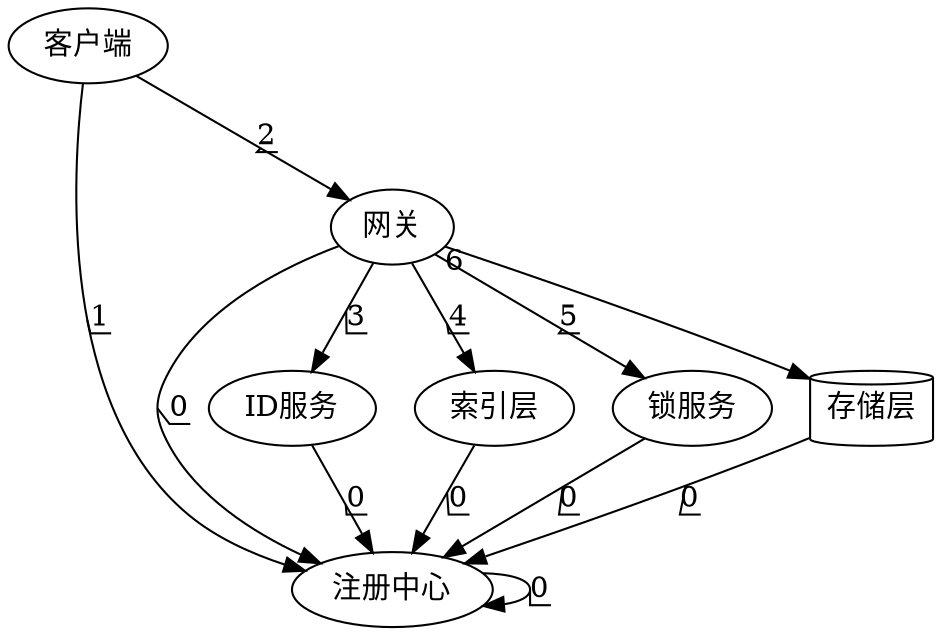

# 总体设计

## 目的

在找工作期间，了解了后台开发在企业中常用的技术点。所以想通过此次综合课程设计，使我可以更深入的掌握如下技术的原理及基本实现：

* 数据库原理
* 分布式系统

## 设计目标

* 数据库功能
  * 支持单表的增删改查（多表联合可以不实现）
  * 支持精确查找和范围查找
  * 支持索引
  * 支持基本数据类型（字符串、整形等）
  * 支持事务
* 分布式系统
  * 实现一个CP的系统
  * 支持增减节点自动化，自动数据迁移

## 层次与模块

由于需要实现的是一个分布式系统，将系统划分为以下几个模块。每个模块内部自治，模块与模块之间通过网络进行通信。为了实现高可用每个模块必须有三个以上个节点。

* 客户端（驱动）
* 注册中心（元数据）
* 网关（分析与执行）
* 锁服务
* ID服务（自增ID/事务ID）
* 索引层
* 存储层

为保证一致性，`索引层`和`存储层`必须保证两个节点以上确认操作成功后才可以进行进一步操作。

### 客户端

`客户端`使用户使用本系统的工具。他的表现形式可以是命令行工具、JDBC（ODBC）驱动、可视化工具等

为了简单起见本系统仅实现一个命令行工具`客户端`。

`客户端`只可以直接与`注册中心`、`网关通信`

`客户端`基本流程

* 启动：从配置或参数中读取`注册中心`的网络位置
* 与`注册中心`建立连接
* 若连接失败，进入**异常流程1**
* 读取最新的`网关`和其他`注册中心`的网络位置列表
* 关闭连接
* 等待用户输入
* 用户输入后，随机选取一个`网关`节点，发送用户请求，等待`网关`响应
* 若`网关`无响应，重试其他`网关`节点
* 若所有`网关`节点无响应，进行进入**异常流程2**

`客户端`的异常流程

* 异常流程1
  * 直接退出程序，并提示用户异常
* 异常流程2
  * 重新选择一个`注册中心`获取相关信息
  * 若所有`注册中心`都无效，进入异常流程1

### 注册中心

注册中心，存储了如下信息

* `客户端` 无
* `注册中心`其他注册中心的网络位置
* `网关` 的网络位置（ip端口）
* `锁服务` 的网络位置（ip端口）
* `ID服务` 的网络位置（ip端口）
* `索引层` 的网络位置及对应那张表的那个索引
* `存储层` 的网络位置及对应哪张表
* 表的元数据

除了`客户端`节点，其他所有节点在启动之初都要向`注册中心`注册自己的网络状态和自己的相关信息。

所有节点要访问其他节点，都需要向`注册中心`获取其他节点的网络位置

每个`注册中心`都存储了所有表格的元数据

### 网关

所有的`网关`节点都有的主要功能为：分析与执行客户端传送来的指令，与`锁服务`、`ID服务`、`索引层`与`存储层`交互

`网关`是连接`客户端`与底层服务的桥梁。

`网关`基本流程

* 启动：从配置或参数中读取`注册中心`的网络位置
* 与`注册中心`建立连接
* 若连接失败，进入**异常流程1**
* 读取最新的其他节点的网络位置列表与元数据信息
* 关闭连接
* 等待`客户端`请求
* `客户端`请求过来之后，向`索引层`查询主键集合
* 根据情况，向`锁服务`申请加锁
* 根据情况向ID服务申请ID
* 向`存储层`发起请求
* 以上网络交互异常进入`异常流程3`

`网关`的异常流程

* 异常流程1
  * 直接返回异常，并提示用户异常
* 异常流程2
  * 重新选择一个`注册中心`获取相关信息
  * 若所有`注册中心`都无效，进入异常流程1
* 异常流程3
  * 重新选择`其他节点`尝试
  * 若所有节点无效，进入异常流程1

### 锁服务

`锁服务`，为了控制并发提供的服务。集群中有多个，每个`锁服务`针对一个表或多个表。每个表在集群中仅有一个`锁服务`。当一个`锁服务`不可用，其他`锁服务`立即接替该服务。此时所有进行中的涉及以上服务的事务异常结束回滚

### ID服务

在一个集群中只有有一个`主ID服务`提供服务：负责全局互斥资源的持有与控制，具体表现为：

* 自增ID（不保证每次都只自增1）
* 事务ID（不保证每次都只自增1）

当某个`主ID服务`不可用，会从现有`ID服务`中选取一个晋升为`主ID服务`。

### 索引层

存储索引信息，以B+树实现，用于实现快速的范围与精确查询

每个`索引层`节点可以包含多个索引。整个集群每个索引保证至少存在3个副本

### 存储层

真正存储数据的层次，使用Hash结构存储，用于实现快速的精确查询。在该层，需要使用`MVCC`实现高并发。

### 交互图

