# B+树

***

<!-- @import "[TOC]" {cmd="toc" depthFrom=2 depthTo=6 orderedList=false} -->

<!-- code_chunk_output -->

* [B+树简介](#b树简介)
* [参考文献及链接](#参考文献及链接)
* [B+树的定义](#b树的定义)
  * [相关术语](#相关术语)
  * [详细定义](#详细定义)
* [B+树的性能](#b树的性能)
* [B+树的例子](#b树的例子)
* [B+树基本操作](#b树基本操作)
  * [查询](#查询)
  * [插入](#插入)
  * [删除](#删除)

<!-- /code_chunk_output -->


## B+树简介

***

B+树一种数据结构，一般用作数据库索引的存储结构，是一颗多叉树。

结合了有序数组（范围查找）和ALV（插入删除效率高）好处，特性如下

* 支持精确查找
* 支持范围查找
* 局部性较好

## 参考文献及链接

***

* [旧金山大学数据结构可视化](https://www.cs.usfca.edu/~galles/visualization/BPlusTree.html)
* [B+Tree百度百科](https://baike.baidu.com/item/B%2B%E6%A0%91)

## B+树的定义

***

### 相关术语

* 索引：在计算机中，一般在数据库相关场景使用，是一种用于快速检索的数据结构。对于无序的数据项，想要根据某些条件检索数据，必须从头到尾遍历一遍，这样的时间复杂度为`O(n)`，效率实在太低。使用索引的目的就是使查询时间复杂度提升一个数量级以上
* 树中的度
  * 树节点的度：等于节点孩子的数目
  * 树的度：树中所有节点的度的最大值

### 详细定义

假设树的度为`m`，B+树的定义如下

* `m>=3`（若`m==2`，树会退化为链表；`m==1`，树无法形成）
* 同一个节点内按照`key`从小到大排序
* 叶子节点包含 数目相同的`key`和`value`，和一个指向右孩子的指针next
  * `key[i]`与`value[i]`一一对应
  * 所有的叶子节点在同一层
* 非叶子节点包含 数目相同`key`和`pointer`（指向孩子的指针）
  * `key[i]`子树为`pointer[i]`，满足`pointer[i]`这棵树的key的取值范围为`[key[i], key[i+1])`
* 根节点
  * 若是叶子节点 `key`的数目取值范围为：`[0, m]`
  * 若是非叶子节点 `key`的取值范围为：`[(m+1)/2, m]` （`(m+1)/2`等价于m/2向上取整）
* 非根节点 key的数目取值范围为：`[(m+1)/2, m]`

满足以上性质的多叉树为B+树

## B+树的性能

***

* 查询效率`O(logn)`
* 插入效率`O(logn)`
* 删除效率`O(logn)`
* 空间利用率大于`1/2`

## B+树的例子

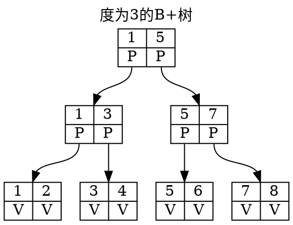

## B+树基本操作

***

### 查询

给一个颗B+树和一个key，查询对应的value

1. 开始
2. p = 根节点
3. 对p.key数组进行二分查找，找到第一个小于等于key的元素的下标i
4. 若p是叶子节点直接返回p.value[i]
5. 若p不是叶子节点 p=p.children[i]，跳到第2步
6. 结束

### 插入

给一个颗B+树和一个`<key,value>`，将其插入B+树

这是个递归算法

1. 定义函数`insert`，接收树的节点和键值对
2. 对根节点调用`insert`

```c
Node insert(now, key, value){
  if(now is 叶子节点){
    将<key,value>插入到now相应的位置，使now.key数组有序
  } else {
    对now.key数组进行二分查找，找到第一个小于等于key的元素的下标i
    new = insert(now.children[i],key,value)
    if(new!=NULL)
      将<new.key[0],new>插入到now相应的位置，使now.key数组有序
  }
  if(now元素数>树的度)
    将now后一半的元素放到一个新的Node中，并返回
  返回NULL
}
```

例子：度为3的B+树插入key为`[3,2,5,7,8,1,4,6]`的过程

图示说明：

* 红色节点表示这一步已经被删除
* 绿色节点表示相对上一步新创建
* 蓝色节点表示相对上一步发生修改
* 黑色节点表示相对上一步没有发生变化

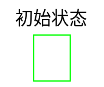

```dot
digraph BPlusTree {
  label ="插入3";
  labelloc = "t"
  node [
    shape="record"
    margin="0.1,0.01"
    nojustify=false
    width=0.4
  ]
  
  r [color=blue, label="{3|V}"]
}
```

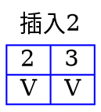

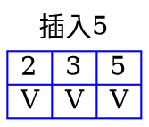

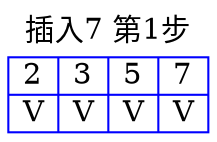

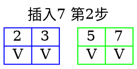

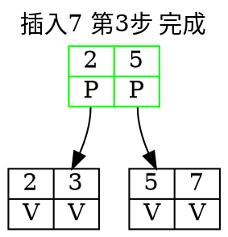

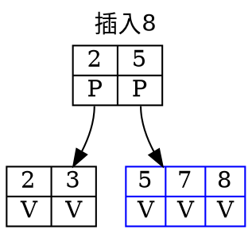

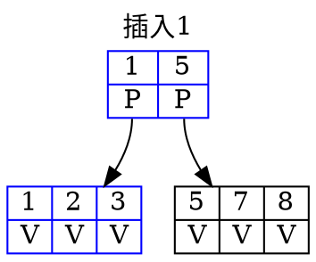

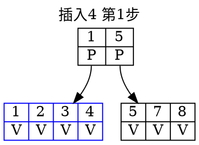

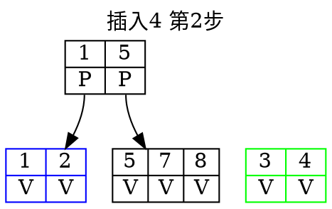

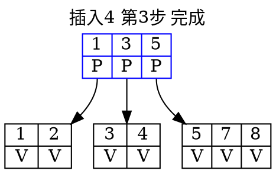

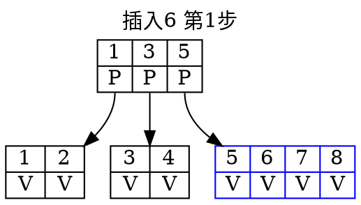

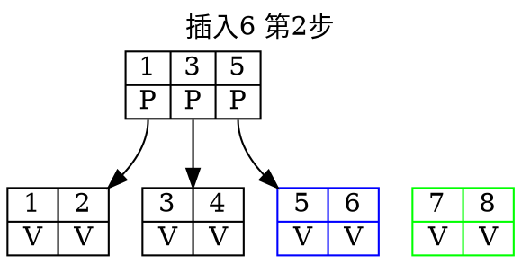

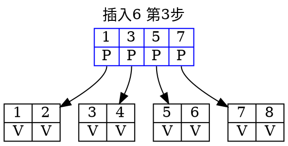

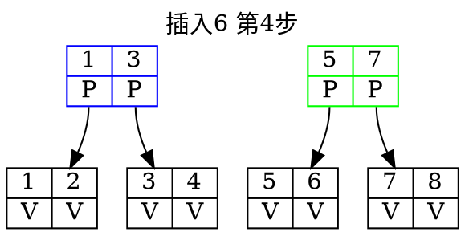

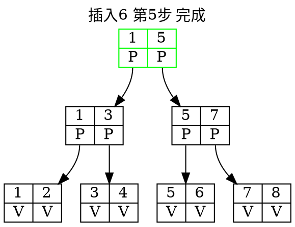

### 删除

给一个颗B+树和一个`key`，将其从B+树中删除

这是个递归算法

1. 定义函数`remove`，接收树的节点和键值对
2. 对根节点调用`remove`

```c
int remove(now, key){
  if(now is 叶子节点){
    将key从now中删除
    return 1
  } else {
    对now.key数组进行二分查找，找到第一个小于等于key的元素的下标i
    cnt = remove(now.children[i],key)
    if(now.children[i].size过少不满足树的定义){
      if(now.children[i]与其左兄弟的节点数均衡下满足树的定义){
        均衡下元素，返回cnt
      } else {
        now.children[i]与其左兄弟合并成一个节点;并删除now一个引用
        返回cnt
      }
    }
  }
  
}
```

例子：度为3的如下B+树；依次删除`key=[7,3,1,4]`

图示说明：

* 红色节点表示这一步已经被删除
* 绿色节点表示相对上一步新创建
* 蓝色节点表示相对上一步发生修改
* 黑色节点表示相对上一步没有发生变化

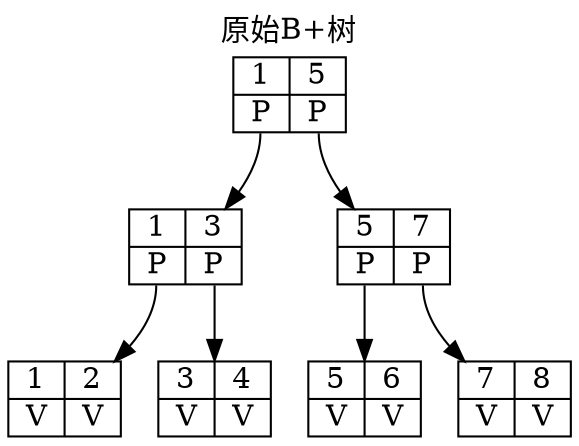

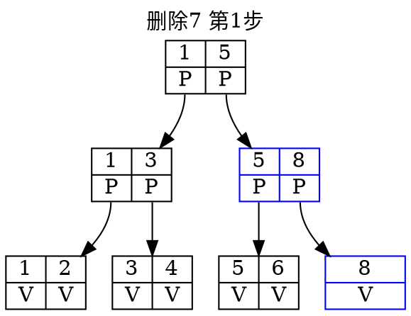

```dot
digraph BPlusTree {
  label ="删除7 第2步";
  labelloc = "t"
  node [
    shape="record"
    margin="0.1,0.01"
    nojustify=false
  ]
  r [label="{1|<p1>P}|{5|<p2>P}"]
  n1 [label="{1|<p1>P}|{3|<p2>P}"]
  n2 [color="blue", label="{5|<p3>P}"]
  l1 [label="{1|V}|{2|V}"]
  l2 [label="{3|V}|{4|V}"]
  l3 [label="{5|V}|{6|V}|{8|V}"]
  l4 [color="red", label="{8|V}"]
  {rank=same; l3;l4}
  
  r:p1:s ->n1
  r:p2:s ->n2
  n1:p1:s->l1
  n1:p2->l2
  n2:p3:s->l3
}
```

```dot
digraph BPlusTree {
  label ="删除7 第3步";
  labelloc = "t"
  node [
    shape="record"
    margin="0.1,0.01"
    nojustify=false
  ]
  r [color="blue", label="{1|<p1>P}"]
  n1 [label="{1|<p1>P}|{3|<p2>P}|{5|<p3>P}"]
  n2 [color="red", label="{5|<p3>P}"]
  l1 [label="{1|V}|{2|V}"]
  l2 [label="{3|V}|{4|V}"]
  l3 [label="{5|V}|{6|V}|{8|V}"]

  {rank=same; n1; n2}

  r:p1:s ->n1
  n1:p1:s->l1
  n1:p2->l2
  n1:p3:s->l3
}
```

```dot
digraph BPlusTree {
  label ="删除7 第4步 完成";
  labelloc = "t"
  node [
    shape="record"
    margin="0.1,0.01"
    nojustify=false
  ]

  n1 [label="{1|<p1>P}|{3|<p2>P}|{5|<p3>P}"]
  r [color="red", label="{1|<p1>P}"]
  l1 [label="{1|V}|{2|V}"]
  l2 [label="{3|V}|{4|V}"]
  l3 [label="{5|V}|{6|V}|{8|V}"]


  n1:p1:s->l1
  n1:p2->l2
  n1:p3:s->l3
}
```

```dot
digraph BPlusTree {
  label ="删除3 第1步";
  labelloc = "t"
  node [
    shape="record"
    margin="0.1,0.01"
    nojustify=false
  ]

  r [color="blue", label="{1|<p1>P}|{4|<p2>P}|{5|<p3>P}"]
  l1 [label="{1|V}|{2|V}"]
  l2 [color="blue", label="{4|V}"]
  l3 [label="{5|V}|{6|V}|{8|V}"]


  r:p1:s->l1
  r:p2->l2
  r:p3:s->l3
}
```

```dot
digraph BPlusTree {
  label ="删除3 第2步 完成";
  labelloc = "t"
  node [
    shape="record"
    margin="0.1,0.01"
    nojustify=false
  ]

  r [color="blue", label="{1|<p1>P}|{5|<p3>P}"]
  l1 [color="blue",label="{1|V}|{2|V}|{4|V}"]
  l2 [color="red", label="{4|V}"]
  l3 [label="{5|V}|{6|V}|{8|V}"]

  {rank=same; l2;l3}

  r:p1:s->l1
  r:p3:s->l3
}
```

```dot
digraph BPlusTree {
  label ="删除1";
  labelloc = "t"
  node [
    shape="record"
    margin="0.1,0.01"
    nojustify=false
  ]

  r [color="blue", label="{2|<p1>P}|{5|<p3>P}"]
  l1 [color="blue",label="{2|V}|{4|V}"]
  l2 [label="{5|V}|{6|V}|{8|V}"]


  r:p1:s->l1
  r:p3:s->l2
}
```

```dot
digraph BPlusTree {
  label ="删除4 第1步";
  labelloc = "t"
  node [
    shape="record"
    margin="0.1,0.01"
    nojustify=false
  ]

  r [label="{2|<p1>P}|{5|<p3>P}"]
  l1 [color="blue",label="{2|V}"]
  l2 [label="{5|V}|{6|V}|{8|V}"]


  r:p1:s->l1
  r:p3:s->l2
}
```

```dot
digraph BPlusTree {
  label ="删除4 第2步 完成";
  labelloc = "t"
  node [
    shape="record"
    margin="0.1,0.01"
    nojustify=false
  ]

  r [color="blue",label="{2|<p1>P}|{6|<p3>P}"]
  l1 [color="blue",label="{2|V}|{5|V}"]
  l2 [color="blue",label="{6|V}|{8|V}"]


  r:p1:s->l1
  r:p3:s->l2
}
```