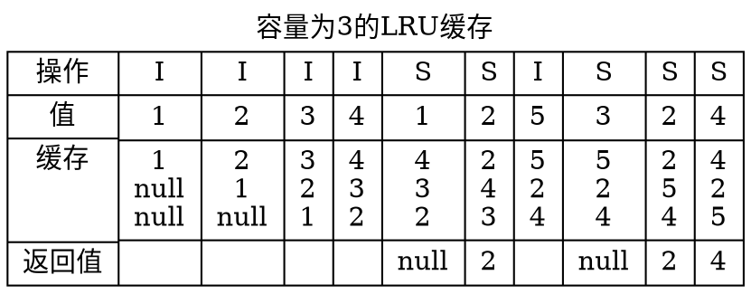

# LRU缓存

***

<!-- @import "[TOC]" {cmd="toc" depthFrom=2 depthTo=6 orderedList=false} -->

<!-- code_chunk_output -->

* [LRU缓存简介](#lru缓存简介)
* [参考文献及链接](#参考文献及链接)
* [相关术语](#相关术语)
* [缓存性能要求](#缓存性能要求)
* [LRU缓存的例子](#lru缓存的例子)
* [LRU缓存实现](#lru缓存实现)
  * [数据结构](#数据结构)
  * [基本操作](#基本操作)
    * [查询](#查询)
    * [插入](#插入)

<!-- /code_chunk_output -->

## LRU缓存简介

***

由于内存容量有限，但是速度快；所以需要引入缓存机制。

数据库的数据存在磁盘中，但是磁盘访问速度太慢，所以需要预先将数据读到内存中。内存中存放磁盘数据的副本的区域就叫缓存。

由于内存空间有限，不可能将磁盘中的所有数据放到内存中。所以缓存必须要有淘汰策略。LRU就是一种常用的淘汰策略，全称最近最少使用（Least recently used）。

## 参考文献及链接

***

* [LRU百度百科](https://baike.baidu.com/item/LRU)

## 相关术语

* 缓存：在计算机中，存在这样的现象，即大容量的存储设备访问速度慢价格便宜，小容量的存储设备访问速度快价格昂贵。所以在计算机采取层次化的存储结构。CPU经常访问的数据一般从大容量的存储设备读到访问快的小容量设备中，以提高执行速度。这种机制称为缓存
* LRU算法：最近最少使用算法
  * 当缓存没有满时，新插入的数据直接放入缓存
  * 当缓存满了时，删除最近最少使用的那一项，然后在将数据插入缓存

## 缓存性能要求

***

* 查询效率`O(1)`
* 插入效率`O(1)`

## LRU缓存的例子

图例说明

* `I` 表示插入
* `S` 表示查询

## LRU缓存实现

***

### 数据结构

查询要达到`O(1)`的数据结构只有个HashTable，LRU算法可以使用双向链表实现

所以LRU缓存是HashTable和双向链表的结合体

### 基本操作

#### 查询

给一个`key`从缓存中查询`value`

1. 从HashTable中查询该记录
2. 若该记录不存在返回`NULL`
3. 若该记录存在，将该节点移动到链表首部，返回`value`

#### 插入

给一个`<key,value>`向缓存中插入，若`key`存在则修改`value`为新的value

1. 从HashTable中查询该记录
2. 若该记录存在则修改value，并移动到链表首部
3. 若该记录不存在
4. 若缓存满，删除链表尾部的节点，执行第6步
5. 若缓存不满，执行第6步
6. 将记录插到HashTable和双向链表中