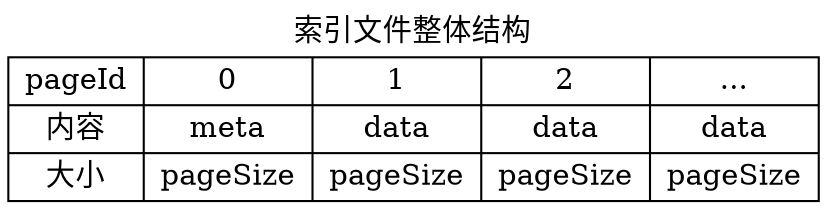
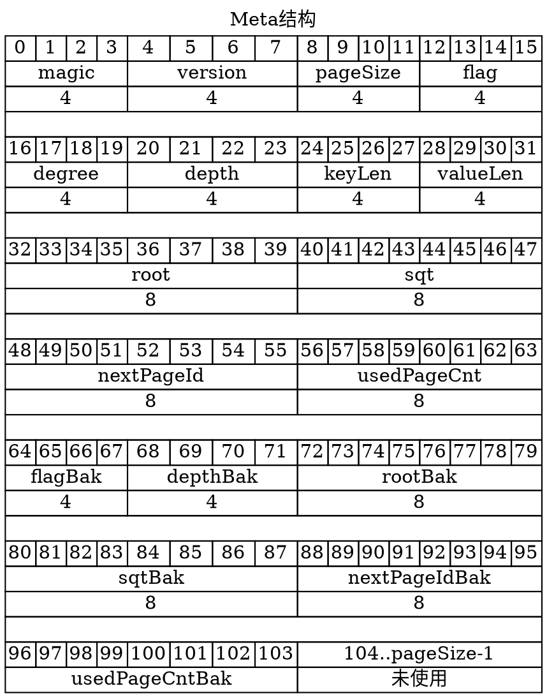
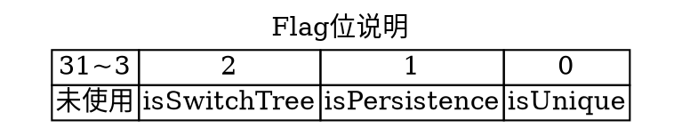
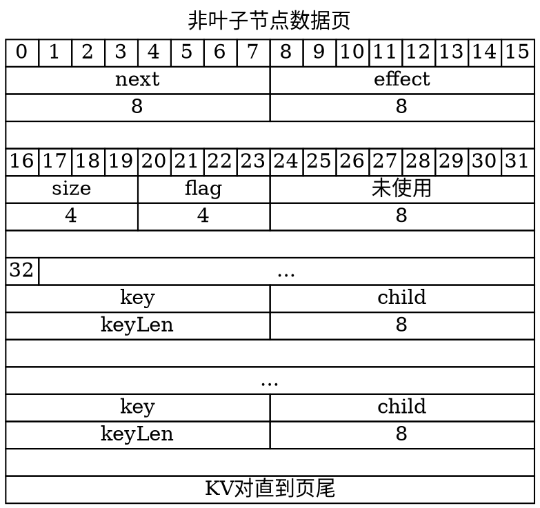
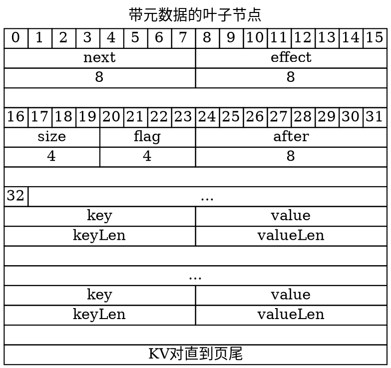
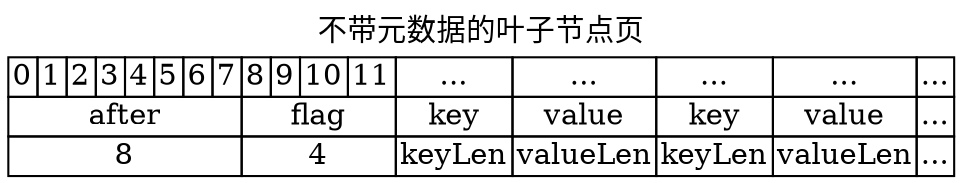

# 索引存储引擎

<!-- @import "[TOC]" {cmd="toc" depthFrom=2 depthTo=6 orderedList=false} -->

<!-- code_chunk_output -->

* [设计目标](#设计目标)
* [概要设计](#概要设计)
	* [缓存方案](#缓存方案)
	* [重做日志](#重做日志)
	* [内存操作](#内存操作)
	* [持久化](#持久化)
	* [从磁盘中读入](#从磁盘中读入)
	* [故障恢复](#故障恢复)
	* [碎片整理](#碎片整理)
* [索引文件存储协议](#索引文件存储协议)
	* [元数据页结构](#元数据页结构)
	* [数据页结构](#数据页结构)
		* [非叶子节点数据页结构](#非叶子节点数据页结构)
		* [叶子节点数据页结构](#叶子节点数据页结构)
			* [带元数据的叶子节点页](#带元数据的叶子节点页)
			* [不带元数据的叶子节点页](#不带元数据的叶子节点页)

<!-- /code_chunk_output -->

## 设计目标

* 数据持久化到磁盘中
* 支持可配置的固定长度的key
* 查询效率要高，使用缓存
  * 支持精确查找，时间复杂度`O(logn)`
  * 支持范围查找，时间复杂度`O(logn+m)`
* 插入效率要高
  * 支持插入删除
  * 支持任意时刻断电恢复
  * 故障允许短时间或少量数据的丢失
* 文件大小理论上无限值（最大2^64）

## 概要设计

使用B+树来构建索引，操作磁盘的粒度为页（默认16k），也就是B+树的一个结点

由于写回磁盘的代价过高，所以采用异步的方式将**修改**或**新增的节点**写回磁盘

为了简化设计，每个索引文件对应一个进程处理；本文描述的都是针对单个索引文件的操作。

### 缓存方案

在进行数据（`<K,V>`）操作（插入/修改/删除）时，必然涉及读写数据。这里使用三个两类LRU缓存（下文称LRU）进行磁盘数据的缓存：

* 第一类缓存（`unchangedCache`）：存放在执行一系列操作过程中没有发生更改的节点（也就是与磁盘中的数据一致的数据）。
  * 这样的LRU需要1个。
  * 这些数据都是从磁盘中读取而来的
* 第二类缓存（`changedCache`）：存放发生修改的节点（也就是与磁盘不一致或者磁盘不存在的数据）
  * 这样的LRU需要2个，每次使用1个，当一个满了之后，将会异步做持久化操作，另一个启用工作
  * 这些数据都是`unchangedCache`发生修改的数据在淘汰时添加而来的
  * 工作中的LRU叫做`changeCacheWork`
  * 持久化中的LRU叫做`changeCacheFreeze`

### 重做日志

同时由于数据延时异步刷磁盘，所以要使用重做日志（Redo log）防止数据丢失

* 每个第二类缓存对应一个重做日志文件，
* 当一个第二类缓存在使用中，对象的写操作将追加到重做日志中
* 当一个第二类缓存持久化完成后就可以清空对应的重做日志

### 内存操作

针对操作大概流程如下

* 收到一个操作
* 一、先读`changeCache`
* `changeCacheFreeze`查找操作节点，存在则拷贝一份
  * 若发生更改，放入`changeCacheWork`
  * 若没有发生更改忽略
* `changeCacheFreeze`不存在
* `changeCacheWork`中查找，存在，返回该节点引用，直接修改即可
* `changeCacheWork`不存在
* 向`unchangeCache`中查找，存在，返回该节点引用，直接修改即可
* `unchangeCache`不存在
* 二、再读`unchangeCache`
* 从磁盘中读入，插入`unchangeCache`并返回
  * 插入过程中若发生淘汰，淘汰的节点若发生修改则插入`changeCacheWork`
  * 当`changeCacheWork`满，且`changeCacheFreeze`持久化完成，则交换两者身份后，异步对`changeCacheFreeze`进行持久化

注意所有发生修改的节点都要分配新的页Id

### 持久化

持久化过程的思路是，在持久化过程中，要维护两棵树在磁盘中。这样若在持久化过程中发生故障；在启动后可以通过原树+重做日志恢复数据。

`changeCacheFreeze`中的节点分为3类：

* 第一类节点（`newNode`）：新创建的节点，内存存在，磁盘不存在
* 第二类节点（`updateNode`）：更新的节点，内存存在新的，磁盘存在旧的
* 第三类节点（`removeNode`）：被删除的节点，内存存被标记删除，磁盘存在

`changeCacheFreeze`两种状态：

* 第一种状态：正在进行持久化
  * 此时不能进行两个`changeCache`的切换
  * 且必须先读`changeCacheFreeze`再读`changeCacheWork`
* 第一种状态：可以进行持久化
  * 此时可以进行两个`changeCache`的切换
  * 不需要读`changeCacheFreeze`，直接读`changeCacheWork`

大概执行过程为

* 修改磁盘中文件某字段标记正在进行持久化
* 需要对`changeCacheFreeze`进行几次遍历
* 第一次遍历：
  * 将所有`newNode`写入磁盘
* 第二次遍历：
  * 将所有`updateNode`
  * 写入新的页Id所在的位置，
  * 将旧的页中的一个专用指针（`effect`）执行新的页Id
  * 将旧的页中的废弃标记标记为`1`
* 第三次遍历：
  * 将所有`removeNode`的废弃标记标记为`1`
* 将磁盘中文件的部分元数据备份到备份区域
* 修改磁盘中文件某字段标记为正在进行元数据修改
* 修改元数据（切换树，因为有两个树）
* 恢复所有标记字段

### 从磁盘中读入

需要注意的是，读对应的节点若为废弃，则直接读`effect`指向的页

### 故障恢复

故障分为几种情况

* 没有线程进行持久化操作：
  * 直接执行重做日志
* 线程持久化操作中，但没有进行修改元数据：
  * 遍历，将所有遍历到的废弃标记清空
  * 直接执行重做日志
* 线程持久化操作中，正在元数据修改：
  * 从元数据备份区进行元数据恢复
  * 遍历，将所有遍历到的废弃标记清空
  * 直接执行重做日志

### 碎片整理

由于持久化操作会产生大量副本，且删除仅仅标记为废弃，所以磁盘文件会无限膨胀，所以需要进行文件碎片整理

注意：

* 碎片整理会阻塞所有写操作
* 没有线程进行持久化

## 索引文件存储协议

使用B+树数据结构

* 索引文件划分为多个连续的页（`Page`）
* 每个页大小可配置（`pageSize`，默认`16k`），取值范围为`[64,2^64]`
* 每个页按顺序进行编号，从`0`开始
* 第`0`页，存放元数据（`meta`）
* 其他页存放数据（`data`）
* 所有数据以网络字节序存储（大端）

### 元数据页结构

* `magic` 4字节 魔数 `0x960729db` 表示该文件是索引存储文件
* `version` 4字节 文件版本号 目前为 `1`
* `pageSize` 4字节 页大小 默认为 `16k`
* `flag` 4字节 标志
  * `flag[0]` `isUnique` 表示该索引文件是否唯一
  * `flag[1]` `isPersistence` 是否正在进行持久化
  * `flag[2]` `isSwitchTree` 是否正在进行切换树
  * `flag[31..3]`未定义
* `degree` 4字节 B+树的度，根据`pageSize`计算和`data`页结构计算
* `depth` 4字节 树的深度，用于判断树叶子节点
* `keyLen` 4字节 键字节数 长度，简单起见 小于 `(页长度-链接数据页控制字段)/3`
* `valueLen` 4字节 值字节数，简单起见 小于 `(页长度-叶子数据页控制字段-keyLen)`
* `root` 8字节 根节点所在的页
* `sqt` 8字节 第一个叶子节点所在的页
* `nextPageId` 8字节 下一个可用页的号
* `usedPageCnt` 8字节 `[1, nextPageId)`已将使用的页的数目，结合`nextPageId`在达到一定情况下进行自动磁盘整理
* `xxxBak` 重要数据的备份，用于断电恢复

注意：`keyLen`和`valueLen`的限制是为保证一个页至少放下一对`KV`

### 数据页结构

#### 非叶子节点数据页结构

* `next` 8字节 表示右兄弟所在的页
* `effect` 8字节
  * `0` 表示数据在该页
  * `!0` 表示数据不在该页（也就是说该页被废弃），数据在effect指向的页
* `size` 4字节 该页已使用的key的数目，不能大于`degree`
* `flag` 4字节 标志
  * `flag[0]` 该页是否被废弃
  * `flag[31..1]`未定义
* `key` `keyLen`字节 键
* `child` 8字节 键指向孩子所在的页

#### 叶子节点数据页结构

由于叶子节点带有`value`，但是`value`的长度可能很长。所以可能一个页存放不下一个叶子节点所以需要多个页。

##### 带元数据的叶子节点页

与非叶子节点数据页区别在于

* `after` 8字节 同属于该节点的下一个数据页的页好
* `value` `valueLen`字节 存放的是数据

##### 不带元数据的叶子节点页

* `after` 8字节 同属于该节点的下一个数据页的页号
* `flag` 同非叶子节点中的`flag`
